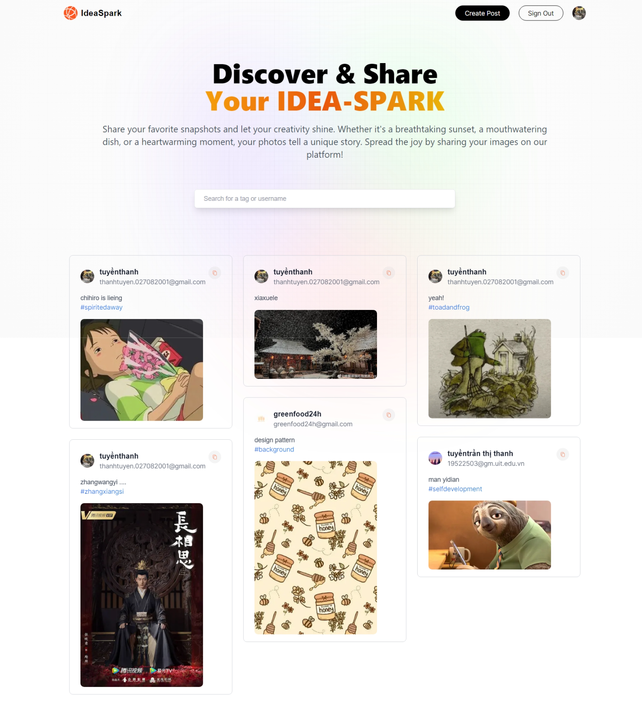

# Project Title
IdeaSpark

# Project description
IdeaSpark is a social media website that sharing images. You can create and share picture wih other user on the platform.

# Features
- Authorization 
- Create and share posts, delete, update your prompt
- Checkout other profiles.
- Store image on cloud (cloudinary)
- Search for tag, username, post caption

# Technologies
- React libraries
- NextJS framework 
- MongoDB 
- Tailwind 
